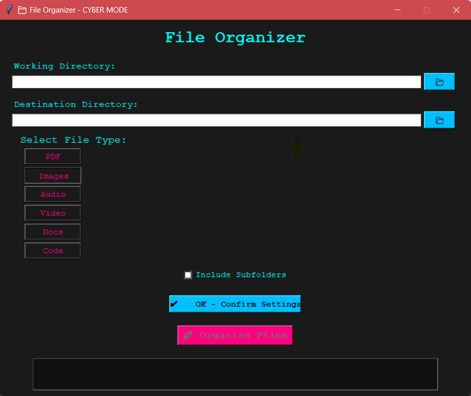

# 📁 Python File Organizer – CLI & GUI

> A flexible file organizer app written in Python that helps you sort files by type into folders. Comes with both a **CLI version** and a **cyberpunk-style GUI**!


## 🎯 Project Overview

This is a simple yet powerful file organization tool built using Python. It allows users to:

- Select a working directory
- Choose a destination folder
- Pick a file category (PDFs, Images, Code, etc.)
- Organize files by moving them to the selected folder
- Option to include subdirectories
- Supports both **command-line interface (CLI)** and a **GUI mode**


## 🧠 Features

✅ Move files by extension  
✅ Choose from 6 preset categories: PDF, Images, Audio, Video, Docs, Code  
✅ Recursive scanning of subfolders  
✅ Cyberpunk-style GUI with neon theme  
✅ Safe path validation and user confirmation  
✅ Easy to extend and customize  

## 📦 Requirements

Make sure you have Python 3.6+ installed.

### Libraries Used:
- `tkinter` – For GUI (comes with Python)
- `pathlib` – For modern path handling
- `shutil` – For file operations
- `os` – For system-level operations

No external packages required — pure Python 🐍


## 📁 Folder Structure

```
project_root/
│
├── operations/
│   ├── __init__.py
│   ├── config.py
│   ├── path_checker.py
│   ├── file_selection.py
│   └── file_organiser.py
│
├── main.py
├── gui_launcher.py
└── README.md
```


## 🚀 How to Run

### ▶️ Run the CLI Version

```bash
python main.py
```

Then follow the prompts to:
1. Enter working directory
2. Enter destination directory (optional)
3. Select file type (1–6)
4. Choose whether to include subfolders


### 💻 Run the GUI Version

```bash
python gui_launcher.py
```

A window will appear where you can:
- Browse directories
- Select file type
- Toggle recursive mode
- Click "Organize Files"


## 🛠️ Customization

Want to add your own categories or file types?

Edit `config.py`:

```python
class Config:
    CHOICE_SELECTION_NO = {
        1: 'pdf',
        2: 'images',
        3: 'audio',
        4: 'video',
        5: 'docs',
        6: 'code'
    }

    FILE_CATEGORIES = {
        'images': ['.jpg', '.jpeg', '.png', '.gif', '.bmp', '.webp'],
        'pdf': ['.pdf'],
        'docs': ['.docx', '.xlsx', '.pptx', '.txt', '.csv', '.xls', '.rtf'],
        'code': ['.py', '.js', '.java', '.cpp', '.html', '.css', '.php', '.rb', '.go'],
        'audio': ['.mp3', '.wav', '.aac', '.flac', '.ogg'],
        'video': ['.mp4', '.mkv', '.avi', '.mov', '.wmv', '.flv']
    }
```

Add more categories or extensions easily!


## 🧪 Unit Tests (Optional)

If you’ve added unit tests (`tests/test_operations.py`), run them like this:

```bash
python -m unittest tests.test_operations -v
```

Or use discovery:

```bash
python -m unittest discover -s tests -v
```


## 🖥️ Screenshots (Example)

> 


## 📝 License

MIT License – see [LICENSE](LICENSE) for details.


## 👨‍💻 Author

 Onyx - [GitHub](https://github.com/onyxwizard/)


## 📬 Feedback

Found a bug or want a new feature? Open an issue or send a PR – contributions welcome! 😊


Let me know if you'd like to generate a `LICENSE`, `.gitignore`, or auto-generate this README as part of a GitHub repo setup!